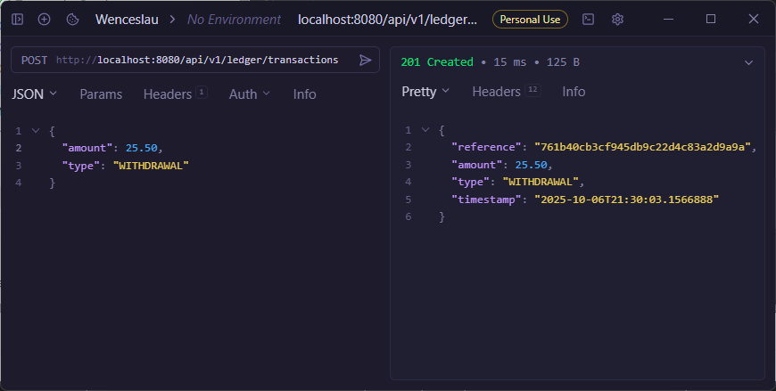
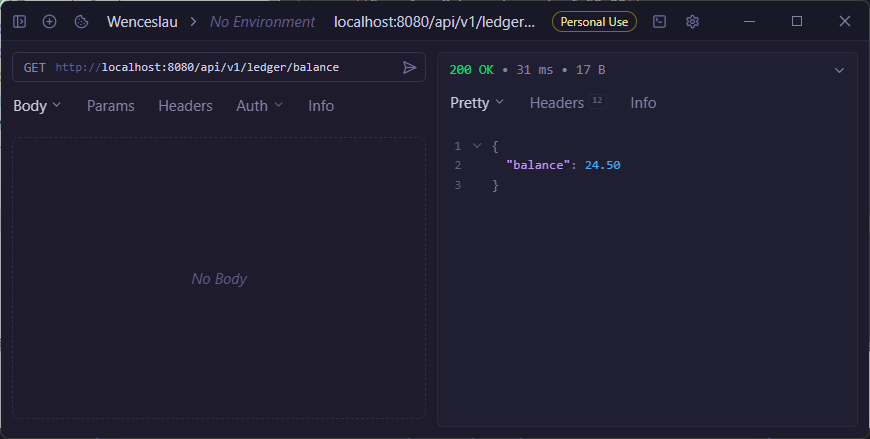
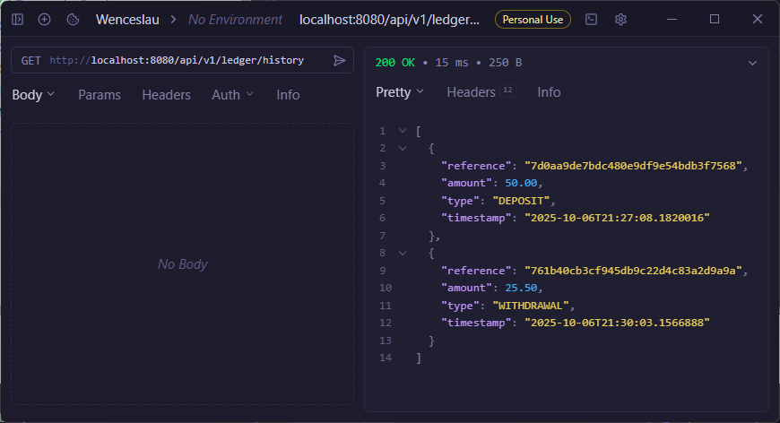
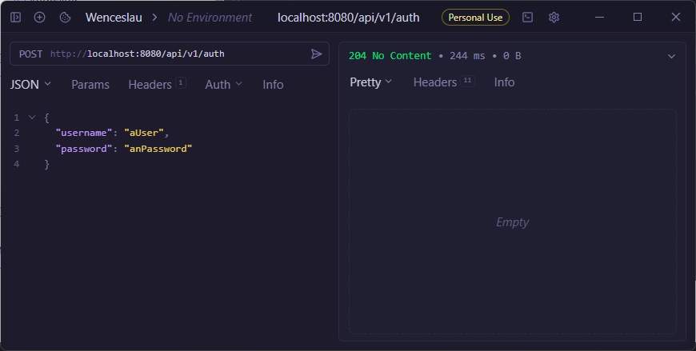

# Tiny Ledger API

This project is a RESTful API built using Java 17 and Spring Boot

## Features

- **Record Transactions**: API endpoint to record deposits and withdrawals.
- **View Current Balance**: API endpoint to get the current account balance.
- **View Transaction History**: API endpoint to retrieve a list of all transactions.
- **API Documentation**: Integrated Swagger UI for interactive API documentation.
- **Authentication**: API endpoint to make a simple authentication with user and password. (disabled on local profile)

## Assumptions Made

1. **In-Memory Storage**: All data (balance and transaction history) is stored in-memory. Data will be reset upon
   application restart.
2. **Single Account**: The ledger manages a single, global account. There is no concept of multiple users or accounts.
3. **Concurrency**: Basic thread-safety is implemented at the data storage level (using `AtomicReference` and
   `CopyOnWriteArrayList`) to handle concurrent reads and writes safely. However, complex, multi-operation transactional
   atomicity was not implemented as per the instructions.
4. **Timestamps**: Transaction timestamps are generated using the server's local date and time (`LocalDateTime.now()`).
5. **Authentication**: Simple login with user and password. JWT Token is generated and added in a security cookie. No
   control was implemented for user and password, empty values are accepted. (disabled on local profile)

## Technology Stack

- **Java 17**
- **Spring Boot 3.3.1**: For building the web application.
- **Maven**: For dependency management and build automation.
- **JUnit 5 & AssertJ**: For unit testing.
- **Springdoc OpenAPI**: For generating Swagger UI documentation.
- **JWT**: For authentication. (disabled on local profile)

---

## How to Run the Application

### Prerequisites

- **JDK 17** or later.
- **Apache Maven** 3.6 or later.

### Steps

1. **Clone the repository:**
   ```sh
   git clone <your-repository-url>
   cd wn-tiny-ledger
   ```

2. **Build and run the application using Maven:**
   ```sh
   mvn spring-boot:run
   ```

The application will start on `http://localhost:8080`.

---

## API Endpoints & Examples

The base URL for the API is `http://localhost:8080/api`.

You can also explore the API interactively via Swagger UI at:
**http://localhost:8080/api/swagger-ui.html**

### 1. Record a Transaction

Records a new deposit or withdrawal.

- **URL**: `http://localhost:8080/api/v1/ledger/transactions`
- **Method**: `POST`
- **Body**:
    - `amount`: A positive number.
    - `type`: `DEPOSIT` or `WITHDRAWAL`.

**Example: Make a deposit of 50.00**

```sh
curl --request POST \
--url http://localhost:8080/api/v1/ledger/transactions \
--header 'content-type: application/json' \
--data '{"amount": 50.00, "type": "DEPOSIT"}'
```


**Example: Make a withdrawal of 25.50**

```sh
curl --request POST \
--url http://localhost:8080/api/v1/ledger/transactions \
--header 'content-type: application/json' \
--data '{"amount": 25.50, "type": "WITHDRAWAL"}'
```



### 2. Get Current Balance

Retrieves the current account balance.

- **URL**: `http://localhost:8080/api/v1/ledger/balance`
- **Method**: `GET`

**Example:**

```sh
curl --request GET \
--url http://localhost:8080/api/v1/ledger/balance
````



### 3. Get Transaction History

Retrieves a list of all recorded transactions.

- **URL**: `http://localhost:8080/api/v1/ledger/history`
- **Method**: `GET`

**Example:**

```sh
curl --request GET \
--url http://localhost:8080/api/v1/ledger/history
```




## Build and run the application using Maven with a prod profile which enables authentication:

### Important Notes

The authentication token is stored in a security cookie. The browser will automatically send the cookie with every request.

Most of the API Client tools (like Postman, Yaak) will automatically send the cookie with every request.

The endpoint test can be done using swagger UI or any other API Client tool with support for cookies.


```sh
mvn spring-boot:run -Dspring-boot.run.profiles=prod
```

### 1. Authentication

Authenticate a user with a username and password.

- **URL**: `http://localhost:8080/api/v1/auth`
- **Method**: `POST`
- **Body**:
    - `username`: A string.
    - `password`: A string.

**Example: Login with username `aUser` and password `anPassword`**


